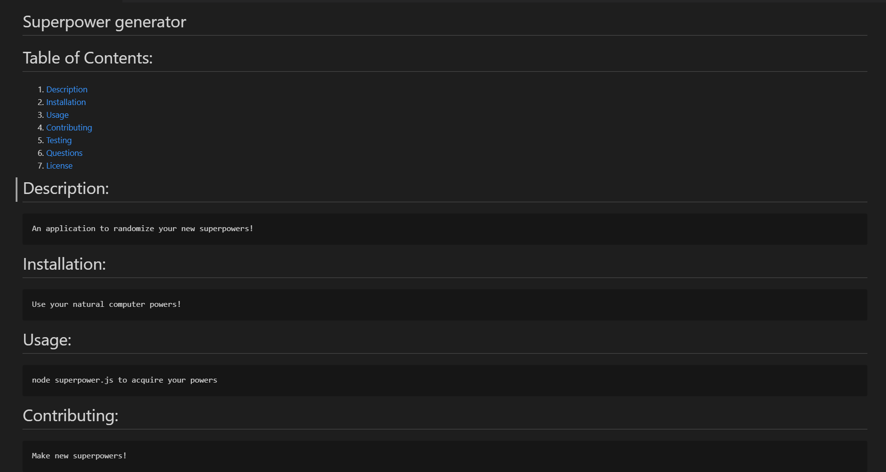
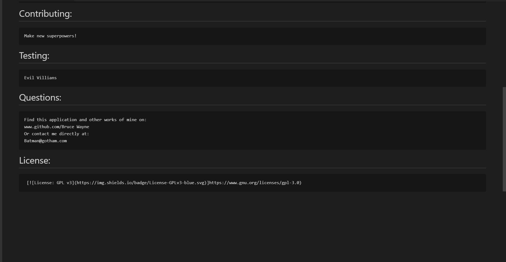
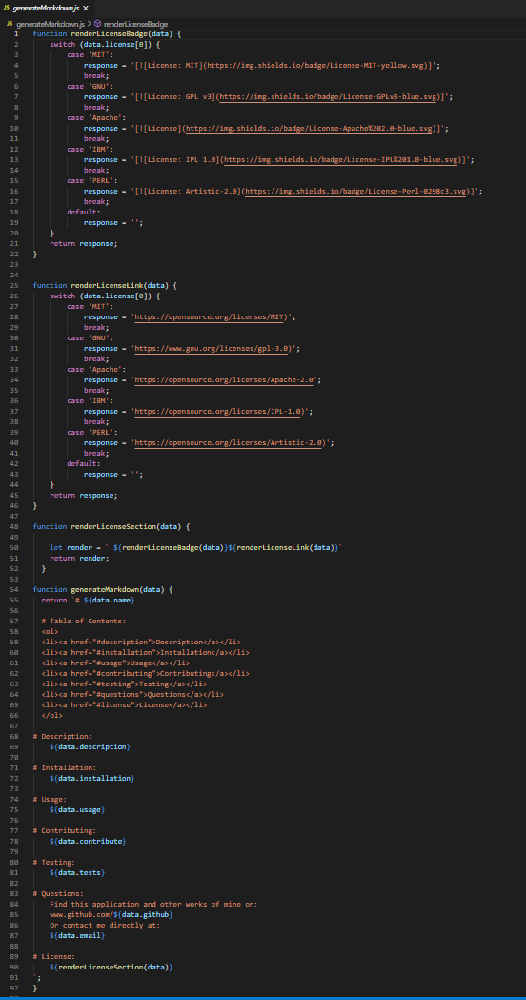
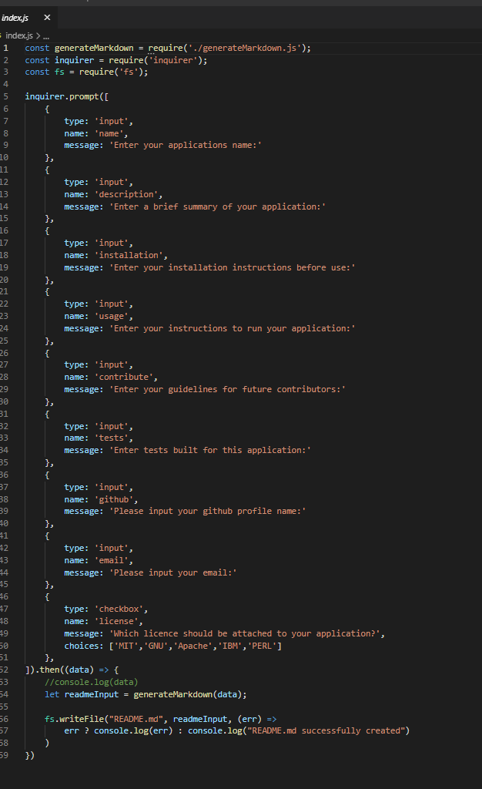

<<<<<<< HEAD
# HW9-README-genny

# My Experience
Coming up with prompts and making the basic layout felt easy enough but figuring out the layout of the markdown genrating threw me off and I was messign up my license adresses causing me a big problem.

# Description
Forking your own version of this repo and installing dependency inquirer allows the user to generate a simple readme using prompts from the command line in a coding terminal. The end result is a clean, basic markdown that can be expanded upon.

# User Story
AS A developer
I WANT a README generator
SO THAT I can quickly create a professional README for a new project

# Project Requirements
GIVEN a command-line application that accepts user input
WHEN I am prompted for information about my application repository
THEN a high-quality, professional README.md is generated with the title of my project and sections entitled Description, Table of Contents, Installation, Usage, License, Contributing, Tests, and Questions
WHEN I enter my project title
THEN this is displayed as the title of the README
WHEN I enter a description, installation instructions, usage information, contribution guidelines, and test instructions
THEN this information is added to the sections of the README entitled Description, Installation, Usage, Contributing, and Tests
WHEN I choose a license for my application from a list of options
THEN a badge for that license is added near the top of the README and a notice is added to the section of the README entitled License that explains which license the application is covered under
WHEN I enter my GitHub username
THEN this is added to the section of the README entitled Questions, with a link to my GitHub profile
WHEN I enter my email address
THEN this is added to the section of the README entitled Questions, with instructions on how to reach me with additional questions
WHEN I click on the links in the Table of Contents
THEN I am taken to the corresponding section of the README

# Installation
Run this app in any coding terminal. Using Javascript and NODE.js you must first use command:
```bash
npm i
```
to install the necessary dependency of inquirer. Then you may run the program using the command:
 ```bash
node index.js
```
# Usage
Using a coding program a user will run this program through the coding terminal. You may run the program using the command:
 ```bash
node index.js
```
This will start the request for user input in several categories for generating a good README file. Upon completion said README will generate.
<br>
Example README: 

An image of code for genrating markdown page with licensing:

An image of the prompts for user input:


link to video walkthrough for this application: https://drive.google.com/file/d/1yW8fJVxbbrGeSsglie4bzh-6aSBnpCgK/view

# Contributions
To contribute on this application please fork the repo on github, clone the repository for personal use, commit to your own branch then push work to your fork and pull request for review and approval.

######
Author: Carter Venne

Github repository: https://github.com/carterVenne/HW9-README-genny

Email: cartervenne@gmail.com
=======
# carter

  # Table of Contents:
  <ol>
  <li><a href="#description">Description</a></li>
  <li><a href="#installation">Installation</a></li>
  <li><a href="#usage">Usage</a></li>
  <li><a href="#contributing">Contributing</a></li>
  <li><a href="#testing">Testing</a></li>
  <li><a href="#questions">Questions</a></li>
  <li><a href="#license">License</a></li>
  </ol>

# Description:
    carter

# Installation:
    carter

# Usage: 
    carter

# Contributing:
    carter

# Testing:
    carter

# Questions:
    Find this application and other works of mine on: 
    www.github.com/carter
    Or contact me directly at:
    carter

# License:
 [](https://opensource.org/licenses/MIT)
>>>>>>> 3f9cb591474d19aa875f6eda3d4ebb0995695d73
